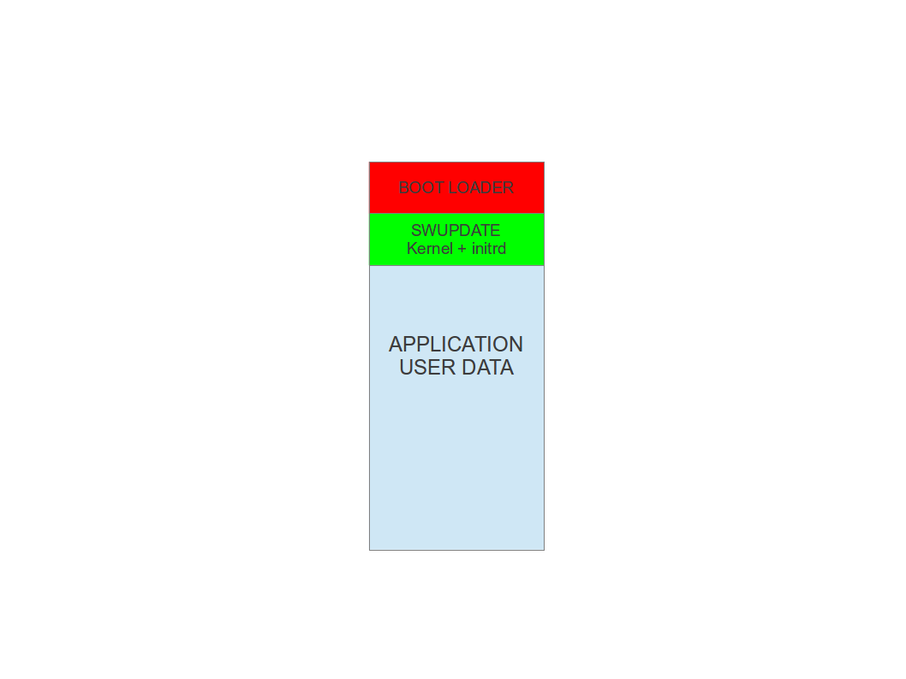

=======================================
Software Management on embedded systems
=======================================

Embedded Systems become more and more complex,
and their software reflects the augmentity complexity.
New features and fixes let much more as desirable that
the software on an embedded system can be updated
in a absolutely reliable way.

On a linux-based system, we can find in most cases
the following elements:
- the bootloader.
- the kernel and the DT (Device Tree) file.
- the root filesystem
- other filesystems, mounted at a later point
- customer data, in raw format or on a filesystem
- application specific software. For example, firmware
to be downloaded on connected microcontrollers, and so on.

Generally speaking, in most cases it is required to update
kernel and root filesystem, preserving user data - but cases vary.

In only a few cases it is required to update the bootloader,
too. In fact, updating the bootloader is quite always risky,
because a failure in the update breaks the board.
Restoring a broken board is possible in some cases,
but this is not left in most cases to the end user
and the system must be sent back to the manufacturer.

There are a lot of different concepts about updating
the software. I like to expone some of them, and then
explain why I have implemented this project.

Updating through the bootloader
===============================

Bootloaders do much more as simply start the kernel.
They have their own shell and can be managed using
a processor's peripheral, in most cases a serial line.
They are often scriptable, letting possible to implement
some kind of software update mechanism.

However, I found some drawbacks in this approach, that
let me search for another solution, based on an application
running on Linux:

Bootloader have limited access to peripherals.
----------------------------------------------

Not all peripherals supported by the kernel are
available with the bootloader. When it makes sense to add
support to the kernel, because the peripheral is then available
by the main application, it does not always make sense to duplicate
the effort to port the driver to the bootloader.

Bootloader's drivers are not updated
------------------------------------

Bootloader's drivers are mostly ported from the Linux kernel,
but due to adaptations they are not later fixed or synchronized
with the kernel, while bug fixes flow regularly in the Linux kernel.
Some peripherals can then work in a not reliable ways,
and fixing the issues can be not easy. Drivers in boot loaders
are more or less a fork of the respective drivers in kernel.

As example, the UBI / UBIFS for NAND devices contains a lot of
fixes in the kernel, that are not ported back to the bootloaders.
The same can be found for the USB stack. The effort to support
new peripherals or protocols is better to be used for the kernel
as for the bootloaders.

Reduced filesystems
-------------------
The number of supported filesystems is limited and
porting a filesystem to the bootloader requires high effort.

Network support is limited
--------------------------
Network stack is limited, generally an update is possible via
UDP but not via TCP.

Interaction with the operator
-----------------------------

It is difficult to expone an interface to the operator,
such as a GUI with a browser or on a display.

A complex logic can be easier implemented inside an application
else in the bootloader. Extending the bootloader becomes complicated
because the whole range of services and libraries are not available.

Bootloader's update advantages
------------------------------
However, this approach has some advantages,too:

- software for update is generally simpler.
- smaller footprint: a standalone application only for software management requires an own kernel and a root filesystem.
  Even if their size can be trimmed dropping what is not required
  for updating the software, their size is not negligible.

Updating through a package manager
==================================

All Linux distributions are updating with a package manager.
Why is it not suitable for embedded ?

I cannot say it cannot be used, but there is an important drawback
using this approach. Embedded systems are well tested
with a specific software. Using a package manager
can put weirdness because the software itself
is not anymore "atomic", but split into a long
list of packages. How can be assured that an application
with library version x.y works, and also with different
versions of the same library ? How can be successful tested ?

For a manufacturer, it is generally better to say that
a new release of software (well tested by his test
engineers) is released, and the new software (or firmware)
is available for updating. Splitting in packages can
generate nightmare and high effort for the testers.

Strategies for an application doing software upgrade
====================================================

Instead of using the bootloader, an application can take
into charge to upgrade the system. The application can
use all services provided by the OS. The proposed solution
is then a stand-alone software, that follow customer rules and
performs checks to determine if a software is installable,
and then install the software on the desired storage.

The application can detect if the provided new software
is suitable for the hardware, and it is can also check if
the software is released by a verified authority. The range
of features can grow from small system to a complex one,
including the possibility to have pre- and post- install
scripts, and so on.

Different strategies can be used, depending on the system's
resources. I am listing some of them.

Double copy with fallback
-------------------------

If there are enough place on the storage to save
two copies of the whole software, it is possible to guarantee
that there is always a working copy even if the software update
is interrupted.

Each copy must contain the kernel, the root filesystem, and each
further component that can be updated. It is required
a mechanism to identify which version is running.

swupdate should be inserted in the application software, and
the application software will trigger it when an update is required.
Duty of swupdate is to update the stand-by copy, leaving the
running copy of the software untouched.

A sinergy with the bootloader is often necessary, because the bootloader must
decide which copy should be started. Again, it must be possible
to switch between the two copies.
After a reboot, the boot loader decides which copy should run.

.. image:: images/double_copy_layout.png

Check the chapter about bootloader to see which mechanisms can be
implemented to guarantee that the target is not broken after an update.

The most evident drawback is the amount of required space. The
available space for each copy is less than half the size
of the storage. However, an update is always safe even in case of power off.

This project supports this strategy. The application as part of this project
should be installed in the rootfilesystem and started
or triggered as required. There is no
need of an own kernel, because the two copies guarantees that
it is always possible to upgrade the not running copy.

swupdate will set U-Boot's variable to signal the bootloader
that a new image is successfully installed.

Single copy - running as standalone image
-----------------------------------------

The software upgrade application consists of kernel (maybe reduced
dropping not required drivers) and a small root filesystem, with the application
and its libraries. The whole size is much less than a single copy of
the system software. Depending on set up, I get sizes from 2.5 until 8 MB
for the standalone root filesystem. If the size is very important on small
systems, it becomes negligible on systems with a lot of storage
or big NANDs.

The system can be put in "upgrade" mode, simply signalling to the
bootloader that the upgrading software must be started. The way
can differ, for example setting a bootloader environment or using
and external GPIO.

The bootloader starts the upgrading software, booting the
swupdate kernel and the initrd image as rootfilesystem. Because it runs in RAM,
it is possible to upgrade the whole storage. Differently as in the
double-copy strategy, the systems must reboot to put itself in
update mode.

This concept consumes less space in storage as having two copies, but
it is not power off safe. However, it can be guaranteed that
the system goes automatically in upgrade mode when the productivity
software is not found or corrupted, as when the upgrade process
was interrupted.

In fact, it is possible to consider
the upgrade procedure as a transaction, and only after the successful
upgrade the new software is set as "bootable". With these considerations,
an upgrade with this strategy is safe: it is always guaranteed that the
system boots and it is ready to get a new software, if the old one
is corrupted or cannot run.
With U-Boot as bootloader, swupdate is able to manage U-Boot's environment
setting variables to indicate the start and the end of a transaction and
that the storage contains a valid software.

swupdate is mainly used in this configuration. The receipes for Yocto
generates a initrd image containing the swupdate application, that is
automatically started after mounting the root filesystem.

.. image:: images/swupdate_single.png

Something went wrong ?
======================

Many things can go wrong, and it must be guaranteed that the system
is able to run again and maybe able to reload a new software to fix
a damaged image. swupdate works together with the U-Boot bootloader to
identify the possible causes of failures.

We can at least group some of the common causes:

- damage / corrupted image during installing.
  swupdate is able to recognize it and the update process
  is interrupted.

- corrupted image in the storage (flash)

- remote update interrupted due to communication problem.

- power-failure

swupdate works as transaction process. The U-Boot variable "recovery_status" is
set to signal U-Boot the update's status. Of course, further variables can be added
to fine tuning and report error causes. recovery_status can have the values "progress",
"failed", or it can be unset.

When swupdate starts, it sets recovery_status to "progress". After an update is finished
with success, the variable is erased. If the update ends with an error, recovery_status
has the value "failed".

When an update is interrupted, independently from the cause, the bootloader
recognizes it because the recovery_status variable is in "progress" or "failed".
The boot loader can then start again swupdate to load again the new software
(single-copy case) or not switch the application's copies and run the old one
as before (double-copy case).

