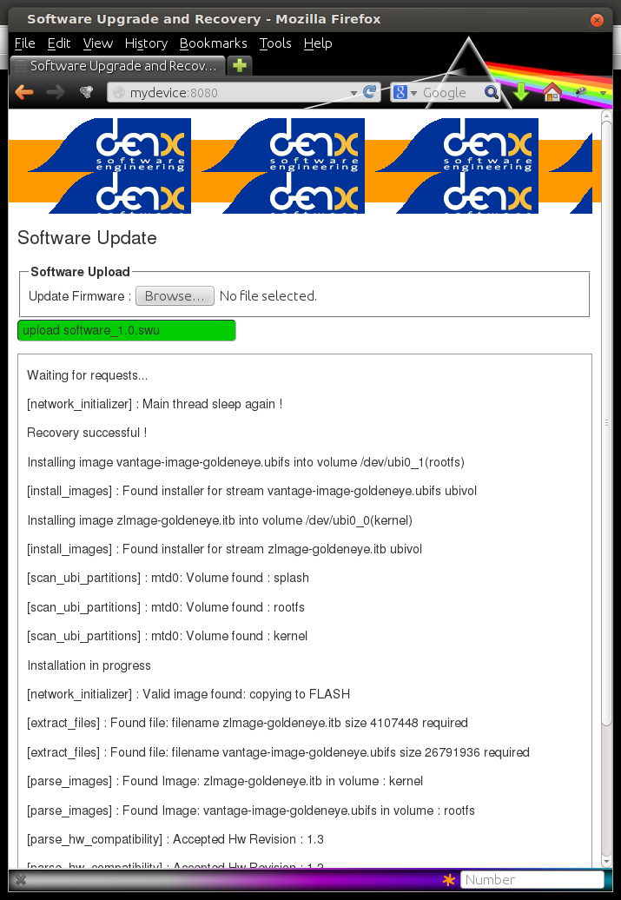

=============================================
SWUpdate: software update for embedded system
=============================================

Overview
========

This project is thought to help to update an embedded
system from a storage media or from network. However,
it should be mainly considered as a framework, where
further protocols or installers (in SWUpdate they are called handlers)
can be easily added to the application.

One use case is to update from an external local media, as
USB-Pen or SD-Card. In this case, the update is done
without any intervention by an operator: it is thought
as "one-key-update", and the software is started at reset
simply pressing a key (or in any way that can be recognized
by the target), making all checks automatically. At the end,
the updating process reports only the status to the operator
(successful or failed).

The output can be displayed on a LCD using the frame-buffer
device or directed to a serial line (Linux console).

It is generally used in the single copy approach, running in a initrd
(recipes are provided to generate with Yocto).  However, it is
possible to use it in a double-copy approach by use of `Software
collections`_.

If started for a remote update, SWUpdate starts an embedded
Web-server and waits for requests. The operator must upload
a suitable image, that SWUpdate checks and then install.
All output is notified to the operator's browser via AJAX
notifications.

Single image delivery
---------------------

The main concept is that the manufacturer delivers a single
big image. All single images are packed together (cpio was chosen
for its simplicity and because can be streamed) together with
an additional file (sw-description), that contains meta
information about each single image.

The format of sw-description can be customized: SWUpdate can be
configured to use its internal parser (based on libconfig), or calling
an external parser in LUA.

.. image:: images/image_format.png

Changing the rules to accept images with an external parser,
let to extend to new image types and how they are installed.
In fact, the scope of the parser is to retrieve which single
images must be installed and how.
SWUpdate implements "handlers" to install a single image:
there are handlers to install images into UBI volumes,
or to a SD card, a CFI Flash, and so on. It is then easy to
add an own handler if a very special installer is required.

For example we can think at a project with a main processor and
one or several micro-controllers. Let's say for simplicity that
the main processor communicates with the micro-controllers via
UARTS using a proprietary protocol. The software on the micro-controllers
can be updated using the proprietary protocol.

It is possible to extend SWUpdate writing a handler, that implements
the part of the proprietary protocol to perform the upgrade
on the micro-controller. The parser must recognize which image must be
installed with the new handler, and SWUpdate will call the handler
during the installation process.

Handling configuration differences
----------------------------------

The concept can be extended to deliver a single image
containing the release for multiple devices. Each device has its own
kernel, dtb and root filesystem, or they can share some parts.

Currently this is managed (and already used in a real project) by
writing an own parser, that checks which images must be installed
after recognizing which is the device where software is running.

Because the external parser can be written in LUA and it is
completely customizable, everybody can set his own rules.
For this specific example, the sw-description is written in XML format,
with tags identifying the images for each device. To run it, the liblxp
library is needed.

::

	<?xml version="1.0" encoding="UTF-8"?>
	<software version="1.0">
	  <name>Update Image</name>
	  <version>1.0.0</version>
	  <description>Firmware for XXXXX Project</description>

	  <images>
	    <image device="firstdevice" version="0.9">
	      <stream name="dev1-uImage" type="ubivol" volume="kernel" />
	      <stream name="dev1.dtb" type="ubivol" volume="dtb" />
	      <stream name="dev1-rootfs.ubifs" type="ubivol" volume="rootfs"/>
	      <stream name="dev1-uboot-env" type="uboot" />
	      <stream name="raw_vfat" type="raw" dest="/dev/mmcblk0p4" />
	      <stream name="sdcard.lua" type="lua" />
	    </image>

	    <image device="seconddevice" version="0.9">
	      <stream name="dev2-uImage" type="ubivol" volume="kernel" />
	      <stream name="dev2.dtb" rev="0.9" type="ubivol" volume="dtb" />
	      <stream name="dev2-rootfs.ubifs" type="ubivol" volume="rootfs"/>
	    </image>
	  </images>
	</software>

The parser for this is in the /examples directory.
By identifying which is the running device, the parser return
a table containing the images that must be installed and their associated
handlers.
By reading the delivered image, SWUpdate will ignore all images that
are not in the list processed by the parser. In this way, it is possible
to have a single delivered image for the update of multiple devices.

Multiple devices are supported by the default parser, too.

::

    software =
    {
        version = "0.1.0";

        target-1 = {
                images: (
                        {
                                ...
                        }
                );
        };

        target-2 = {
                images: (
                        {
                                ...
                        }
                );
        };
    }

In this way, it is possible to have a single image providing software
for each device you have.

By default the hardware information is extracted from
`/etc/hwrevision` file. The file should contain a single line in the
following format::

  <boardname> <revision>

Where:

- `<revision>` will be used for matching with hardware compatibility
  list

- `<boardname>` can be used for grouping board specific settings

Software collections
--------------------

Software collections and operation modes can be used to implement a
dual copy strategy. The simplest case is to define two installation
locations for the firmware image and call `SWUpdate` selecting the
appropriate image.

::

    software =
    {
            version = "0.1.0";

            stable = {
                    copy-1: {
                            images: (
                            {
                                    device = "/dev/mtd4"
                                    ...
                            }
                            );
                    }
                    copy-2: {
                            images: (
                            {
                                    device = "/dev/mtd5"
                                    ...
                            }
                            );
                    }
            };
    }

In this way it is possible to specify that `copy-1` gets installed to
`/dev/mtd4`, while `copy-2` to `/dev/mtd5`. By properly selecting the
installation locations, `SWUpdate` will update the firmware in the
other slot.

The method of image selection is out of the scope of SWUpdate and user
is responsible for calling `SWUpdate` passing proper settings.

Streaming feature
-----------------

SWUpdate is thought to be able to stream the received image directly into
the target, without any temporary copy. In fact, the single installer
(handler) receive as input the file descriptor set at the beginning of
the image that must be installed.

The feature can be set on image basis, that means that a user can
decide which partial images should be streamed. If not streamed (see
installed-directly flag), files are temporary extracted into /tmp.
Of course, by streaming it is not possible to make checks on the whole delivered
software before installing.
The temporary copy is done only when updated from network. When the image
is stored on an external storage, there is no need of that copy.

List of supported features
--------------------------

- Install on embedded Media (eMMC, SD, Raw NAND,
  NOR and SPI-NOR flashes)

- check if a image is available. The image is built
  in a specified format (cpio) and it must contain
  a file describing the software that must be updated.

- SWUpdate is thought to update UBI volumes (mainly for NAND, but not only)
  and images on devices. Passing a whole image can still be updated
  as a partition on the SD card, or a MTD partition.

- new partition schema. This is bound with UBI volume.
  SWUpdate can recreate UBI volumes, resizing them and
  copying the new software. A special UBI volume with the name "data"
  is saved and restored after repartitioning with all data
  it contains,  to maintain user's data.

- support for compressed images, using the zlib library.
  tarball (tgz file) are supported.

- support for partitioned USB-pen or unpartitioned (mainly
  used by Windows).

- support for updating a single file inside a filesystem.
  The filesystem where to put the file must be described.

- checksum for the single components of an image

- use a structured language to describe the image. This is done
  using the libconfig_ library as default parser, that uses a
  JSON-like description.

.. _libconfig:	http://www.hyperrealm.com/libconfig/

- use custom's choice for the description of the image. It is
  possible to write an own parser using the LUA language.
  An example using a XML description in LUA is provided
  in the examples directory.

- Support for setting / erasing U-Boot variables

- Support for preinstall scripts. They run before updating the images

- Support for postinstall scripts. They run after updating the images.

- Network installer using an embedded Web-server (Mongoose Server
  was chosen, in the version under LUA license). A different
  Web-server can be used.

- Multiple interfaces for getting software (local Storage,
  integrated Web-Server, remote Server)

- Can be configured to check for compatibility between software and hardware
  revisions. The software image must contain an entry declaring on which
  HW revision the software is allowed to run.
  SWUpdate refuses to install if the compatibility is not verified.

- support for image extraction. A manufacturer can require to have
  a single image that contains the software for more as one device.
  This simplifies the manufacturer's management and reduces
  their administrative costs having a single software product.
  SWUpdate receives the software as stream without temporary storing,
  and extracts only the required components for the device
  to be installed.

- allow custom handlers for installing FPGA firmware,
  micro-controller firmware via custom protocols.

- Features are enabled / disabled using "make menuconfig".
  (Kbuild is inherited from busybox project)

- Power-Off safe

Images fully streamed
---------------------

In case of remote update, SWUpdate extracts relevant images
from the stream and copy them into /tmp before calling the handlers.
This guarantee that an update is initiated only if all parts are present and correct.
However, on some systems with less resources, the amount of RAM
to copy the images could be not enough, for example if the filesystem on
an attached SD Card must be updated. In this case, it will help if the images
are installed directly as stream by the corresponding handler, without temporary
copies. Not all handlers support to stream directly into the target.
Streaming with zero-copy is enabled by setting the flag "installed-directly"
in the description of the single image.

Configuration and build
=======================

Requirements
------------

There are only a few libraries that are required to compile SWUpdate.

- mtd-utils: internally, mtd-utils generates libmtd and libubi.
  They are commonly not exported and not installed, but they are
  linked by SWUpdate to reuse the same functions for upgrading
  MTD and UBI volumes.
- openssl: required with the Webserver
- LUA: liblua and the development headers.
- libz, libcrypto are always linked.
- libconfig: it is used by the default parser.
- libarchive (optional) for archive handler
- libjson (optional) for JSON parser

New handlers can add some other libraries to the requirement list -
check if you need all handlers in case you get build errors,
and drop what you do not need.

Building with Yocto
-------------------

A meta-SWUpdate layer is provided. It contains the required changes
for mtd-utils and for generating LUA. Using meta-SWUpdate is a
straightforward process.

Firstly, clone meta-SWUpdate from:

.. _meta_SWUpdate:  https://github.com/sbabic/meta-swupdate.git

Add meta-SWUpdate as usual to your bblayers.conf.

In meta-SWUpdate there is a recipe to generate a initrd with a
rescue system with SWUpdate. Use:

::

	MACHINE=<your machine> bitbake swupdate-image

You will find the result in your tmp/deploy/<your machine> directory.
How to install and start a initrd is very target specific - please
check in the documentation of your bootloader.

Configuring SWUpdate
--------------------

SWUpdate is configurable via "make menuconfig". The small footprint
is reached using the internal parser and disabling the web-server.
Any option has a small help describing its usage. In the default
configuration, many options are already activated.

To configure the options:

::

	make menuconfig

Building
--------

- to cross-compile, set the CC and CXX variables before running make.
  It is also possible to set the cross-compiler prefix as option with
  make menuconfig.
- generate the code

::

	make

The result is the binary "SWUpdate".

Running SWUpdate
================

What is expected from a SWUpdate run
------------------------------------

A run of SWUpdate consists mainly of the following steps:

- check for media (USB-pen)
- check for an image file. The extension must be .swu
- extracts sw-description from the image and verifies it
  It parses sw-description creating a raw description in RAM
  about the activities that must be performed.
- Reads the cpio archive and proofs the checksum of each single file
  SWUpdate stops if the archive is not complete verified
- check for hardware-software compatibility, if any,
  reading hardware revision from hardware and matching
  with the table in sw-description.
- check that all components described in sw-description are
  really in the cpio archive.
- modify partitions, if required. This consists in a resize
  of UBI volumes, not a resize of MTD partition.
  A volume with the name "data" is saved and restored after
  resizing.
- runs pre-install scripts
- iterates through all images and call the corresponding
  handler for installing on target.
- runs post-install scripts
- update u-boot environment, if changes are specified
  in sw-description.
- reports the status to the operator (stdout)

The first step that fails, stops the entire procedure and
an error is reported.

To start SWUpdate expecting the image from a file:

::

	        swupdate -i <filename>

To start with the embedded web-server:

::

	         swupdate -w "<web-server options>"

The main important parameter for the web-server is "document_root".

::

	         SWUpdate -w "-document_root ./www"

The embedded web-server is taken from the Mongoose project (last release
with LUA license). Additional parameters can be found in mongoose
documentation.
This uses as website the pages delivered with the code. Of course,
they can be customized and replaced. The website uses AJAX to communicate
with SWUpdate, and to show the progress of the update to the operator.

The default port of the Web-server is 8080. You can then connect to the target with:

::

	http://<target_ip>:8080

If it works, the start page should be displayed as in next figure.

.. image:: images/website.png

If a correct image is downloaded, SWUpdate starts to process the received image.
All notifications are sent back to the browser. SWUpdate provides a mechanism
to send to a receiver the progress of the installation. In fact, SWUpdate
takes a list of objects that registers itself with the application
and they will be informed any time the application calls the notify() function.
This allows also for self-written handlers to inform the upper layers about
error conditions or simply return the status. It is then simply to add
own receivers to implement customized way to display the results: displaying
on a LCD (if the target has one), or sending back to another device via
network.
An example of the notifications sent back to the browser is in the next figure:

Software collections can be specified by passing `--select` command
line option. Assuming `sw-description` file contains a collection
named `stable`, with `alt` installation location, `SWUpdate` can be
called like this::

   swupdate --select stable,alt

Command line parameters
-----------------------

+-------------+----------+--------------------------------------------+
|  Parameter  | Type     | Description                                |
+=============+==========+============================================+
| -b <string> | string   | Active only if CONFIG_MTD is set           |
|             |          | It allows to blacklist MTDs when SWUpdate  |
|             |          | searches for UBI volumes.                  |
|             |          | Example: U-Boot and environment in MTD0-1: |
|             |          | **swupdate -b "0 1"**                      |
+-------------+----------+--------------------------------------------+
| -d <URL>    | string   | Active only if CONFIG_DOWNLOAD is set      |
|             |          | This is the URL where new software is      |
|             |          | pulled. URL is a link to a valid .swu image|
+-------------+----------+--------------------------------------------+
| -r <retries>| integer  | Active only if CONFIG_DOWNLOAD is set      |
|             |          | Number of retries before a download is     |
|             |          | considered broken. With "-r 0", SWUpdate   |
|             |          | will not stop until a valid software is    |
|             |          | loaded.                                    |
+-------------+----------+--------------------------------------------+
| -e <sel>    | string   | sel is in the format <software>,<mode>     |
|             |          | It allows to find a subset of rules in     |
|             |          | the sw-description file. With it,          |
|             |          | multiple rules are allowed.                |
|             |          | One common usage is in case of the dual    |
|             |          | copy approach. Example:                    |
|             |          | -e "stable, copy1"  ==> install on copy1   |
|             |          | -e "stable, copy2"  ==> install on copy2   |
+-------------+----------+--------------------------------------------+
| -h          |    -     | run usage with help                        |
+-------------+----------+--------------------------------------------+
| -k          | string   | Active if CONFIG_SIGNED is set             |
|             |          | Filename with the public key               |
+-------------+----------+--------------------------------------------+
| -l <level>  |    int   | Set loglevel                               |
+-------------+----------+--------------------------------------------+
| -L          |    -     | Send LOG output to syslog(local)           |
+-------------+----------+--------------------------------------------+
| -i <file>   | string   | run SWUpdate with a local .swu file        |
+-------------+----------+--------------------------------------------+
| -v          |    -     | activate verbose output                    |
+-------------+----------+--------------------------------------------+
| -w <parms>  | string   | start internal webserver and pass to it    |
|             |          | a command line string.                     |
+-------------+----------+--------------------------------------------+
| -u <parms>  | string   | start internal suricatta client daemon and |
|             |          | pass to it a command line string.          |
|             |          | see suricatta's documentation for details. |
+-------------+----------+--------------------------------------------+
| -H          | string   | set board name and Hardware revision       |
| <board:rev> |          |                                            |
+-------------+----------+--------------------------------------------+
| -t <timeout>| integer  | Timeout for connection lost when           |
|             |          | downloading                                |
+-------------+----------+--------------------------------------------+
| -c          |    -     | This will check ``*.swu`` file against     |
|             |          | internal tests. It ensures that files      |
|             |          | referenced in sw-description are present.  |
|             |          | Usage: swupdate -c -i <file>               |
+-------------+----------+--------------------------------------------+

Changes in boot-loader code
===========================

The SWUpdate consists of kernel and a root filesystem
(image) that must be started by the boot-loader.
In case using U-Boot, the following mechanism can be implemented:

- U-Boot checks if a sw update is required (check gpio, serial console, etc.).
- the script "altbootcmd" sets the rules to start SWUpdate
- in case SWUpdate is required, u-boot run the script "altbootcmd"

Is it safe to change U-Boot environment ? Well, it is, but U-Boot must
be configured correctly. U-Boot supports two copies of the environment
to be power-off safe during a an evironment update. The board's
configuration file must have defined CONFIG_ENV_OFFSET_REDUND or
CONFIG_ENV_ADDR_REDUND. Check in U-Boot documentation for these
constants and how to use them.

There are a further enhancement that can be optionally integrated
into u-boot to make the system safer. The most important I will
suggest is to add support for boot counter in u-boot (documentation
is in U-Boot docs). This allows U-Boot to track for attempts to
successfully run the application, and if the boot counter is
greater as a limit, can start automatically SWUpdate to replace
a corrupt software.

Building a single image
=======================

cpio is used as container for its simplicity. The resulting image is very
simple to be built.
The file describing the images ("sw-description", but the name can be configured)
must be the first file in the cpio archive.

To produce an image, a script like this can be used:

::

	CONTAINER_VER="1.0"
	PRODUCT_NAME="my-software"
	FILES="sw-description image1.ubifs  \
	       image2.gz.u-boot uImage.bin myfile sdcard.img"
	for i in $FILES;do
		echo $i;done | cpio -ov -H crc >  ${PRODUCT_NAME}_${CONTAINER_VER}.swu

The single images can be put in any order inside the cpio container, with the exception
of sw-description, that must be the first one.
To check your generated image you can run the following command:

::

    swupdate -c -i my-software_1.0.swu

